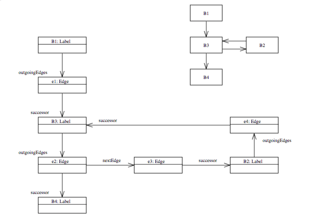

# ASM

* [主要数据结构](#主要数据结构)
  * [对象模型](#对象模型)
  * [Collections](#Collections)
* [主要算法](#主要算法)
  * [ClassReader](#ClassReader)
  * [ClassWriter, AnnotationWriter, FieldWriter, MethodWriter and ModuleWriter](#ClassWriter)
  * [Label](#Label)
  * [toByteArray](#toByteArray)
* [跳转指令编码算法](#跳转指令编码算法)
  * [基本算法](#基本算法)
  * [对stack map frames的影响](#对stackmapframes的影响)
  * [An example](#Anexample)
* [控制和数据流分析算法](#控制和数据流分析算法)
  * [基本数据流分析算法](#基本数据流分析算法)
  * [未初始化的类型](#未初始化的类型)
  * [异常处理程序](#异常处理程序)
  * [Dead code](#Deadcode)
  * [子程序](#子程序)

## <a name="主要数据结构">主要数据结构</a>

### <a name="对象模型">对象模型</a>

核心程序包由28个类和接口组成。如果我们排除Opcodes接口，5个抽象访问者类（`AnnotationVisitor`， `ClassVisitor`，`FieldVisitor`， `MethodVisitor` 和 `ModuleVisitor`）和6实用工具类（`ConstantDynamic`， `Constants`，`Handle`，`Type`， `TypePath` 和 `TypeReference`），这样，只有16个类。

编译类到访问事件的转换仅由一个类（即`ClassReader`类）完成，该类使用辅助类`Context`。 逆过程由围绕ClassWriter类组织的其他14个类完成：

|Classes|`ClassWriter`类是主要的入口点。 它包含描述类版本，访问标志，名称等的字段。它还包含对表示常量池的其他对象的引用，**字段，方法，注解和类的属性**。|
|---|---|
|Constant pool|`SymbolTable`类用于表示常量池和引导程序方法，以及用于计算堆栈映射帧的ASM特定类型表。 这些结构以字节数组形式和符号实例的哈希集形式表示，以便有效地测试给定的常量池项，引导方法或类型是否已添加到符号表中。 该类是从`ClassWriter`，`AnnotationWriter`，`FieldWriter`，`MethodWriter`和`ModuleWriter`类引用的，因为类，注解，字段，方法和模块需要将它们引用的常量添加到常量池和/或`bootstrap`方法。<br><br>`Symbol`类用于表示用于计算堆栈映射帧的单个常量池项，单个引导方法或单个ASM特定类型。|
|Fields|`FieldWriter`类用于写入字段。 它包含描述该字段的**名称，类型，签名，值**等的字段。它还包含对其他表示该字段的**注解和属性**的对象的引用。|
|Methods|`MethodWriter`类用于编写方法。它包含描述方法**名称，签名，异常**等的字段。它还包含对其他表示该方法的**注解和属性**的对象的引用。该方法的代码存储在字节数组中，该字节数组是在访问字节码指令期间构造的。用于参考指令的标签存储在“标签”指令的链接列表中。<br><br>`Label`类用于引用指令，但也表示基本块，这些块用于自动计算最大堆栈大小和方法的堆栈映射框架表。<br><br>`Handler`类用于表示`try catch`块。每个处理程序都引用三个`Label`对象，这些对象定义了try块的开始和结束以及catch块的开始。<br><br>`Frame`和`CurrentFrame`类用于自动计算方法的堆栈图框架。<br><br>`Edge`类用于表示方法的控制流程图，该方法是基本块（即Label对象）的图。边缘是此图中两个Label对象之间的边缘。|
|Modules|`ModuleWriter`类用于编写与模块相关的`Module`，`ModulePackages`和`ModuleMainClass`类属性（将Java模块定义编译到包含这些属性的类文件中）。|
|Annotations|`AnnotationWriter`类用于编写注解。 此类是从`ClassWriter`，`FieldWriter`和`MethodWriter`类引用的，因为类，字段和方法可以具有注解。|
|Attributes|`Attribute`类用于读取和写入非标准类属性。 对于必须读取和写入的每个特定非标准属性，必须将其子类化。 此类是从`ClassWriter`，`FieldWriter`和`MethodWriter`类引用的，因为类，字段和方法可以具有属性。|
|Resources|`ByteVector`类用于在访问类元素时对其进行序列化。 它用于表示**常量池，注解值，方法的代码，堆栈映射表，行号表等**。|

### <a name="Collections">Collections</a>

核心软件包不使用任何`java.util`类。 而是将**列表，集合和图形**编码在其元素的专用字段中：

* 列表表示为链接列表，其链接直接存储在列表元素本身中。 例如，FieldWriter对象列表表示为通过其fv字段链接的FieldWriter对象本身。 对于MethodWriter，AnnotationWriter，Label等也是如此。与使用单独的对象存储链接列表本身（如java.util.LinkedList）相比，此方法的优势在于它节省了内存。 缺点是给定元素不能同时属于多个列表，但这在ASM情况下不是问题。
* 核心包中使用的唯一哈希集在SymbolTable类中，是通过一个SymbolTable.Entry实例数组（Symbol的子类）实现的，可以通过它们的下一个字段将它们链接在一起（以处理哈希冲突的情况）。 换句话说，对于列表，哈希集结构嵌入在哈希集元素本身中。 优点和缺点是相同的（节省内存，但元素不能一次属于多个哈希集）。
* 类似地，**控制流图**数据结构嵌入在图节点本身中，即在Label对象中。



由于`Label`对象必须同时存储在多个数据结构中，因此它们具有几个不同的字段来对这些数据结构进行编码：

* nextBasicBlock字段用于按访问顺序对方法的标签列表进行编码。
* OutingEdges字段用于存储代表控制流图数据结构的Edge对象列表（通过它们的nextEdge字段链接）。
* nextListElement字段用于在用于计算方法的最大堆栈大小和堆栈映射框架的算法中存储标签的临时列表。

## <a name="主要算法">主要算法</a>

### <a name="ClassReader">ClassReader</a>

ClassReader算法非常简单。总结如下：

* 解析常量池和引导程序方法（在构造函数中）：

  * 将每个常量池项目的起始偏移量存储在`cpInfoOffsets`中
  * 将每个引导方法的起始偏移量存储在`bootstrapMethodOffsets`中
  * 将最长字符串常量的大小存储在`maxStringLength`中

* 解析类（在accept和read *方法中）：
  * 解析头
  * 解析类属性。根据属性的复杂性：
    * 解析它并将其值存储在局部变量中（对于包含简单值的属性），
    * 或将其起始偏移量存储在局部变量中（用于具有复杂结构的属性）
  * 调用与检测到的属性相对应的访问方法。对于在上一步中未解析的复杂属性（例如注解），请解析并同时访问它们：即解析一个部分，对其进行访问，解析下一个部分，对其进行访问等。
  * 对于每个字段（在`readField`方法中）：
    * 解析头
    * 解析字段属性。根据属性：
      * 要么解析它并将其值存储在局部变量中，
      * 或将其起始偏移量存储在局部变量中
    * call `visitField`
    * 调用与检测到的属性相对应的访问方法。对于在上一步中未解析的复杂属性（例如注解），请解析并同时访问它们：即解析一个部分，对其进行访问，解析下一个部分，对其进行访问等。
    * call `visitEnd`
  * 对于每个方法（在`readMethod`方法中）：
    * 解析头
    * 解析方法属性。根据属性：
      * 要么解析它并将其值存储在局部变量中，
      * 或将其起始偏移量存储在局部变量中
    * 调用`visitMethod`
    * 如果返回的访问者是`MethodWriter`，并且如果从该阅读器复制了其`ClassWriter`的常量池，则可以按原样复制方法字节：然后跳过下面的所有步骤。
    * 调用与检测到的属性相对应的访问方法。对于在上一步中未解析的复杂属性（例如注解），请解析并同时访问它们：即解析一个部分，对其进行访问，解析下一个部分，对其进行访问等。
    * 对于Code属性的特殊情况（在`readCode`方法中）：
      * 找到标签并将它们存储在`Context.currentMethodLabels`数组中
        * 在代码中寻找标签
        * 在异常处理程序中寻找标签
        * 在行号和局部变量表中查找标签
        * 在其他代码属性中查找标签
      * 如果有堆栈映射表，则解析第一帧
      * 解析指令
        * 如果有用于此偏移量的堆栈映射frame，则调用`visitFrame`并解析下一个frame
        * 如果此偏移量有标签，请call `visitLabel`
        * 如果此偏移量有行号条目，请call `visitLineNumber`
        * call `visitXxxInsn`
      * 为第二步中解析的每个非标准代码属性调用`visitAttribute`
      * call `visitMaxs`
      * call `visitEnd`
    * call `visitEnd`
  * call `visitEnd`

有几点需要注意：

* 行号和堆栈映射frame的访问与指令的访问交织在一起。 在堆栈映射frame的情况下，不仅要进行访问，而且还要对堆栈映射表和方法的代码进行分析。 与解析堆栈映射表然后解析该方法的代码相比，该方法的优点在于，不需要复杂的数据结构来存储第二步的解析帧

* 常量池项每次被引用时都会进行解析，但Utf8和ConstantDynamic项除外，它们的值缓存在cpInfoValues数组中。 同样，不重复使用单个char数组来解析这些项目。 它必须足够大以解析最长的字符串，因此必须在构造函数中计算maxStringLength。

### <a name="ClassWriter">ClassWriter, AnnotationWriter, FieldWriter, MethodWriter and ModuleWriter</a>

由于类成员的访问可以交错（可以开始访问字段，然后开始访问方法，返回访问该字段的注释，继续该方法的一些说明，访问该字段的属性，添加 方法的新指令等），则无法从头到尾按顺序构建类文件的字节数组。 相反，必须使用可以同时增长的几个字节向量。 这就是为什么有多个`writer`类的原因，与`reader`情况不同。

`ClassWriter`类是主要的入口点。 它包含类头元素，其字段和方法的列表以及`SymbolTable`实例，其中包含常量池项和该类的`bootstrap`方法。 此符号表使用符号对象的哈希集，以避免在常量池或引导方法数组中多次添加同一项目。 通过将`ClassReader`参数传递给其构造函数，可以从现有类创建符号表。 这允许将不变的方法从类读取器原样复制到类写入器，而无需访问它们的内容。

`AnnotationWriter`，`FieldWriter`和`ModuleWriter`类非常简单：它们通过使用类编写器的`SymbolTable`将访问事件转换为字节数组表示形式，以便在必要时添加常量池项。 最复杂的writer类是`MethodWriter`类，因为它管理高级功能，例如**自动计算最大堆栈大小和方法的局部变量数**，**自动计算其堆栈映射frames**以及**自动管理短与长跳转指令**。 没有这些功能，每个`visitXxxInsn`方法将非常简单，即仅将指令的字节码表示形式添加到代码字节向量中。

相反，为了能够自动计算最大堆栈大小，最大局部变量数和堆栈映射frames，每次`visitXxxInsn`方法都执行以下操作：

* 将指令附加到代码字节向量
* if (currentBasicBlock != null) // if some automatic computation is needed
  * if (compute == COMPUTE_ALL_FRAMES || compute == COMPUTE_INSERTED_FRAMES)
    * 模拟该指令在堆栈frames上的执行
  * else // compute == COMPUTE_MAX_STACK_AND_LOCAL
    * 模拟该指令在堆栈高度上的执行
  * 跟踪使用的局部变量（如果有）
  * 跟踪此指令的后继者
  * update `currentBasicBlock`

实际上，最大堆栈大小或堆栈映射frames是通过使用`visitXxxInsn`方法中构造的控制流程图在`computeMaxStackAndLocal`和`computeAllFrames`方法中计算的。

### <a name="Label">Label</a>

从用户的角度来看，`Label`类用于引用指令。在内部，它用于存储指令的字节码偏移量（即指令第一个字节的字节码数组索引），并计算相对的字节码偏移量（即两个指令的字节码偏移量之差）。它还用于表示基本块，这些块用于自动计算最大堆栈大小和方法的堆栈映射帧。

跳转指令（例如`IFEQ`或`GOTO`）作为操作码存储在字节码中，后跟目标指令的相对字节码偏移量（此相对偏移量是目标指令的字节码偏移量与跳转指令的字节码偏移量之差）。在后向跳转（即，跳转到字节码中的跳转指令之前的指令）的情况下，可以轻松计算该相对偏移，但是在前向跳转（即跳转到跳转指令之后的指令）的情况下根本无法计算，因为在这种情况下目标指令尚未被访问，因此其字节码偏移量未知。前跳情况可以通过以下方式解决：

* 跳转指令的相对偏移量（临时）等于0
* 已更新目标Label对象，以记住以下事实：此跳转指令对该标签进行了前向引用（为此使用Label中的`forwardReferences`数组）
* 当访问此标签时，即，当其字节码偏移量已知时，该标签的所有前向跳转指令（由`forwardReferences`提供）都会更新，用它们的真实值代替临时的相对偏移，现在可以计算它们。

### <a name="toByteArray">toByteArray</a>

`ClassWriter`中的`toByteArray`方法将在各个writer类中构造的所有片段放在一起，以获得该类的完整字节表示形式。 这分两个步骤完成：

* 类的大小是通过将所有片段的大小相加来计算的，这由getSize方法给出（此方法可以将items添加到常量池中，从而修改其大小；这就是为什么仅在最后添加常量池大小的原因。）
* 分配了此大小的字节向量，然后将片段按正确的顺序复制到该向量中。 这是通过在每个片段上调用`putXxx`方法（例如，每个`FieldWriter`上的`putFieldInfo`）来完成的。

## <a name="跳转指令编码算法">跳转指令编码算法</a>

跳转指令（例如`IFEQ和GOTO`）存储相对字节码偏移量，其符号值编码为两个字节。因此，此偏移量可以在-32768和32767之间变化。但是，方法的字节码可以多达65535字节：因此，可能会有无法用带符号的两个字节值表示的相对字节码偏移量。希望有两个特殊的跳转指令将它们的相对字节码偏移量存储在带符号的四个字节值中，即`GOTO_W和JSR_W`。

在向后跳转的情况下，访问跳转指令时即知道跳转偏移量。 然后，根据此相对偏移的值，可以轻松使用`GOTO或GOTO_W`。但是在向前跳转的情况下这是不可能的。

* 第一种解决方案是假定此偏移量需要4个字节，并且始终将GOTO_W用于向前跳转。 但这不是很理想
* 第二种解决方案是假定此偏移量需要2个字节，并使用普通的跳转指令，并在已知偏移量时保留2个字节来存储该偏移量。 问题在于，如果偏移量需要4个字节，则必须使用4个字节的偏移量将另一个跳转指令替换为该跳转指令，这会使其他跳转指令中已使用的已计算出的偏移量无效。

> 在ASM中，选择了第二个解决方案。 它需要一种方法来替换前跳转指令，而前跳转指令原来需要很长的偏移量。

### <a name="基本算法">基本算法</a>

该算法使用以下属性：
* 最大方法大小（因此，前向跳转偏移量）为65535，可以存储在无符号的两个字节值中
* JVM字节码指令集的操作码未使用所有255个可能的值，并且实际上，有足够的未使用操作码来定义每个标准跳转指令操作码的无符号等效项（我们注意，`ASM_GOTO，ASM_JSR，ASM_IFEQ`等 ）

给定这些属性后，如果在`visitLabel`中发现前向偏移量大于32737，则将相应指令的操作码更改为具有无符号偏移量的等效非标准操作码，偏移量存储为无符号的`short`。

然后，当所有类都被访问并转换为字节数组时，如果使用了某些非标准操作码，则必须将其替换为标准操作码。 为了这：
* 将清除`ClassWriter`的内容（符号表除外），并使用链接到此`ClassWriter`的`ClassReader`解析字节数组，以重建类。 该类使用特殊的`EXPAND_ASM_INSNS`类读取器标志进行解析，其作用将在下面说明。
* 类读取器使用显式的`GOTO_W和JSR_W`指令将ASM特定的指令转换为标准指令，并且由于`EXPAND_ASM_INSNS`标志，使现有的`GOTO_W和JSR_W`指令保持不变（通常将它们转换为`GOTO和JSR`，但这里不是，因为我们知道将需要4个字节的偏移量-避免无限循环清除和重建ClassWriter时也需要这样做）。

此过程删除了现有的ASM特定说明，但可以引入新的说明。 实际上，由于ASM专用指令已被更长的标准指令序列所取代，因此现有指令之间的某些相对偏移量（刚好低于32737限制）可能变得大于此限制。 在这种情况下，将重复该过程：包含新ASM特定指令的字节数组将使用链接到ClassWriter的新ClassReader（在清除ClassWriter内容之后）再次进行解析。 最终，该过程将收敛，结果将是只有标准指令操作码的类。

### <a name="对stackmapframes的影响">对stack map frames的影响</a>

必须使用`IFNotX GOTO_W`序列替换前向偏移量大于32767的`IFXxx`指令，该序列要求在`GOTO_W`之后（对于Java 7或更多类）需要一个堆栈映射frame。此堆栈映射frame可能尚未存在，在这种情况下，需要对其进行计算和插入。 为此，一种解决方案是重新计算所有堆栈映射frame，但这并非总是可能的（计算堆栈映射frame可能需要访问类层次结构，可能会加载类等），并且效率不高。相反，我们使用现有的堆栈映射frames来计算我们需要插入的frame。实际上，按照定义，现有的堆栈映射frame足以计算局部变量和每个指令处的堆栈的状态，而线性算法会从头到尾解析指令和帧。

它的实现如下：
* 当清除`ClassWriter`来替换ASM特定指令时，它将进入`COMPUTE_INSERTED_FRAMES`模式。
* 在这种模式下，`MethodWriter`使用`CurrentFrame`而不是`Frame`来模拟每条指令的执行，这具有显式计算每条指令的局部变量和堆栈状态的效果（通常在`COMPUTE_FRAMES`模式下，此显式 状态仅在基本块级别计算，而不在指令级别计算）。现有框架也可以按原样使用，以用访问的框架替换CurrentFrame。最后，如果访问了特殊类型为F_INSERT的帧，则使用当前帧状态以当前字节码偏移量插入帧。
* 在用于替换ASM特定指令的`ClassReader`中，当将`IFXxx`指令替换为`IFNotX GOTO_W`序列时，将发出一个带有空内容的`visitFrame（F_INSERT，...）`，以便在此位置插入frame。

### <a name="Anexample">An example</a>
考虑以下Java代码：
```java
public void m(int i, int j) {
    for (; cond(i); --i) {
        if (j == 0) {
            break;
        }
        ...
    }
}
```
它被编译成：
```asm
public m(II)V
  GOTO L1
 L2
  ILOAD 2
  IFNE L3
  GOTO L4
 L3
  ...
  IINC 1 -1
 L1
  ALOAD 0
  ILOAD 1
  INVOKEVIRTUAL C.cond(I)Z
  IFNE L2
 L4
  RETURN
```
在访问每条指令期间，将按以下步骤逐步计算偏移量：

|Offset	|Instruction	|Comment
|---|---|---
|0	 |&nbsp;&nbsp;GOTO L1	|relative offset unknown when this instruction is visited
|3	|L2	|
|3	 |&nbsp;&nbsp;ILOAD 2	|
|4	 |&nbsp;&nbsp;IFNE L3	|relative offset unknown when this instruction is visited
|7	 |&nbsp;&nbsp;GOTO L4	|relative offset unknown when this instruction is visited
|10	|L3	|relative offset for IFNE L3 becomes known: 10 - 4 = 6
|10	 |&nbsp;&nbsp;...	|
|32764	 |&nbsp;&nbsp;IINC 1 -1	|
|32767	|L1	|relative offset for GOTO L1 becomes known: 32767 - 0 = 32767
|32767	|&nbsp;&nbsp;ALOAD 0	|
|32768	 |&nbsp;&nbsp;ILOAD 1	|
|32769	 |&nbsp;&nbsp;INVOKEVIRTUAL	|
|32772	 |&nbsp;&nbsp;IFNE L2	|relative offset = 3 - 32772 = -32769
| |L4	|
| |&nbsp;&nbsp;RETURN|

为`IFNE L2`计算的偏移量为-32769，不能存储在一个short中。 因此，该指令会即时转换为`IFEQ GOTO_W L2`：

|Offset	|Instruction	|Comment
|---|---|---
|0	|&nbsp;&nbsp;GOTO L1	|relative offset = 32767, changed during visit of L1
|3	|L2|
|3	|&nbsp;&nbsp;ILOAD 2|
|4	|&nbsp;&nbsp;IFNE L3	|relative offset = 6, changed during visit of L3
|7	|&nbsp;&nbsp;GOTO L4	|relative offset still unknown
|10	|L3|
|10	|&nbsp;&nbsp;...|
|32764	|&nbsp;&nbsp;IINC 1 -1
|32767	|L1
|32767	|&nbsp;&nbsp;ALOAD 0
|32768	|&nbsp;&nbsp;ILOAD 1
|32769	|&nbsp;&nbsp;INVOKEVIRTUAL
|32772	|&nbsp;&nbsp;IFEQ L4	|relative offset = 8
|32775	|&nbsp;&nbsp;GOTO_W L2	|relative offset = 3 - 32775 = -32772
|32780	|L4	|relative offset for GOTO L4 becomes known: 32780 - 7 = 32773
| |&nbsp;&nbsp;RETURN|

当达到L4时，为`GOTO L4`计算的偏移量变为已知：我们得到32773，不能将其存储为有符号的short。 然后将GOTO指令替换为非标准`ASM_GOTO`指令，该指令的偏移量存储为无符号`short`：

|Offset	|Instruction	|Comment
|---|---|---
|0	|&nbsp; GOTO L1	|relative offset = 32767, changed during visit of L1
|3	|L2	|
|3	|&nbsp; ILOAD 2	|
|4	|&nbsp; IFNE L3	|relative offset = 6, changed during visit of L3
|7	|&nbsp; `ASM_GOTO L4`	|relative offset = 32773, changed during visit of L4
|10	|L3	|
|10	|&nbsp; ...	|
|32764	|&nbsp; IINC 1 -1	|
|32767	|L1	|
|32767	|&nbsp; ALOAD 0	|
|32768	|&nbsp; ILOAD 1	|
|32769	|&nbsp; INVOKEVIRTUAL	|
|32772	|&nbsp; IFEQ L4	|relative offset = 8
|32775	|&nbsp; GOTO_W L2	|relative offset = 3 - 32775 = -32772
|32780	|L4	|
|32780	|&nbsp; RETURN|

由于字节码包含至少一条非标准指令，因此在计算出该类的字节数组表示形式之后（在`toByteArray`中），将清除ClassWriter内容，并通过使用链接到此ClassWriter的ClassReader解析字节数组来再次进行重构。在此过程中，ClassReader将`ASM_GOTO`转换为`GOTO_W`（并保留现有的`GOTO_W`）。 当达到L1时，我们得到：

|Offset	|Instruction	|Comment
|---|---|---
|0	|&nbsp; GOTO L1	|relative offset unknown
|3	|L2	|
|3	|&nbsp; ILOAD 2	|
|4	|&nbsp; IFNE L3	|relative offset = 8, changed during visit of L3
|7	|&nbsp; GOTO_W L4	|relative offset unknown
|12	|L3	|
|12	|&nbsp; ...	|
|32766	|&nbsp; IINC 1 -1	|
|32769	|L1	|
| |&nbsp; ALOAD 0	|
| |&nbsp; ILOAD 1	|
| |&nbsp; INVOKEVIRTUAL	|
| |&nbsp; IFEQ L4	|relative offset = 8
| |&nbsp; GOTO_W L2	|
| |L4	|
| |&nbsp; RETURN|

此时，`GOTO L1`的相对偏移即为32769。对于带符号的短偏移而言，此偏移量太大，因此将GOTO L1替换为具有无符号的短偏移的`ASM_GOTO L1`。 然后继续进行类的解析和重构，并最终为该类生成一个新的字节数组。 由于它仍然包含非标准操作码，因此重复相同的过程：通过使用ClassReader解析字节数组，清除并重建ClassWriter内容。 由于特殊的`EXPAND_ASM_INSNS`标志，`GOTO_W`和`JSR_W`永远不会转换回`GOTO`或`JSR`，这确保了此迭代过程最终会收敛。 在我们的示例中，第二次迭代不会产生任何新的非标准操作码，而我们得到的最终结果是：

|Offset	|Instruction	|Comment
|---|---|---
|0	|&nbsp; GOTO_W L1	|relative offset = 32771
|5	|L2	|
|5	|&nbsp; ILOAD 2	|
|6	|&nbsp; IFNE L3	|relative offset = 8
|9	|&nbsp; GOTO_W L4	|relative offset = 32775
|14	|L3	|
|14	|&nbsp; ...	|
|32768	|&nbsp; IINC 1 -1	|
|32771	|L1	|
|32771	|&nbsp; ALOAD 0	|
|32772	|&nbsp; ILOAD 1	|
|32773	|&nbsp; INVOKEVIRTUAL	|
|32776	|&nbsp; IFEQ L4	|reative offset = 8
|32779	|&nbsp; GOTO_W L2	|relative offset = -32774
|32784	|L4	|
|32784	|&nbsp; RETURN|

## <a name="控制和数据流分析算法">控制和数据流分析算法</a>

在`computeAllFrames`方法中实现的用于计算堆栈映射frame的算法。 在`computeMaxStackAndLocal`方法中实现的用于计算最大堆栈大小的算法相似但更简单（因为仅需要堆栈的大小）。

### <a name="基本数据流分析算法">基本数据流分析算法</a>

堆栈映射frames是通过两步过程来计算的：
* 在访问每条指令期间，通过模拟指令对此所谓“输出frame”的先前状态的操作来更新当前基本块末尾的frame状态。
* 在`computeAllFrames`中，使用定点算法来计算每个基本块的“输入frame”，即，从第一个基本块的输入frame开始的堆栈映射frames位于基本块的开头（由方法描述符计算得出），通过使用先前计算的输出frame来计算其他块的输入状态。

让我们举一个简单的例子来解释该算法的细节。 考虑以下非常简单的方法（其中B是A的子类）：

```asm
public static m(Z)LA;
  GETSTATIC B.VALUE : LB;
  ASTORE 1
  GOTO L0
 L1
  GETSTATIC A.VALUE : LA;
  ASTORE 1
 L0
  ILOAD 0
  IFNE L1
  ALOAD 1
  ARETURN
```
#### First step

如上所述，在算法的第一步期间（发生在`ClassWriter`中的每个`visitXxxInsn`方法中），通过模拟被访问指令的动作，更新每个基本块的输出frame的状态。重要的是要注意，该算法在基本块级别而不是指令级别工作。这意味着输入和输出frame与基本块相关联，而不与单个指令相关联。 实际上，它们存储在与Label对象关联的Frame对象中，该对象标记基本块的开始。

下表说明了上述示例方法的第一步效果：

|Label	|Instruction	|Output frame	|Comment
|---|---|---|---
| |GETSTATIC B.VALUE : LB;	|O1 = [??] [?B]	|getstatic pushes a value of type B on the stack
| |ASTORE 1	|O1 = [?B] [?]	|astore consumes this value and stores it in local 1
| |GOTO L0	|O1 = [?B] [?]	|goto does not change the frame
|
|L1	|GETSTATIC A.VALUE : LA;	|O2 = [??] [?A]	|each basic block starts with a new, unknown frame
| |ASTORE 1	|O2 = [?A] [?]	|astore stores the value produced by getstatic in local 1
|
|L0	|ILOAD 0	|O3 = [??] [?I]	|iload pushes the value of local 0, which is of type int
| |IFNE L1	|O3 = [??] [?]	|ifne consumes this value
||
| |ALOAD 1	|O4 = [??] [?L1]	|aload pushes the value of local 1, which is unknown
| |ARETURN	|O4 = [??] [?]	|areturn consumes this value

最初，第一个基本块的输出帧O1完全未知。 在访问第一条指令期间，将模拟`GETSTATIC`的操作：结果是将B类型的新值压入堆栈，位于先前值的顶部（尽管我们知道堆栈最初是空的，但我们 不要考虑到这一点，并且就好像堆栈之前可能包含任意数量的任何类型的值-因此[?B]）。 在访问第二条指令期间，将更新输出帧O1以模拟`ASTORE`的效果：结果是将先前压入堆栈的值弹出并存储在局部变量1中。第三条指令的访问不会更改输出帧O1，但将当前基本块更改为null。

L1标签的访问使L1成为当前新的基本块。 像第一个基本块一样，该基本块的输出帧O2最初是完全未知的。 这样，对该基本块指令的访问类似于对先前指令的访问。

L0标签的访问使L0成为当前新的基本块。 在这里，我们还是从一个完全未知的输出帧O3开始，尽管在这种情况下，我们可以从O2的值开始（因为该基本块是前一个的后继）。 ILOAD指令加载必须为int类型的局部变量0的值（整个算法基于代码正确的假设），并将其压入堆栈。 IFNE指令使用此值。

模拟IFNE指令的动作的另一个效果是创建一个新的基本块，并使它成为新的当前基本块。 这就是为什么尽管在此指令之后没有标签，但基本块却发生了变化。 同样，此基本块的输出帧O4最初是完全未知的（尽管和以前一样，出于相同的原因，我们也可以从O3的值开始）。 ALOAD指令加载局部变量1的值，该变量的类型未知，因为该帧最初是完全未知的。 我们唯一知道的是，在执行此方法之后，堆栈包含一个附加值，该附加值的类型是执行此指令之前的局部变量1的类型（因此[?L1]）。

#### Second step

在算法的第二步（发生在`computeAllFrames`方法中）期间，使用迭代定点算法计算每个基本块的输入帧（即找到由`f(x) = x`定义的函数f的固定点x的算法。如果x值定义了一个完整的晶格，并且f是单调的，则`xn + 1 = f(xn)`收敛到最小的固定点 根据Tarski定理，这里的f是输入和输出帧的控制流程图，f是“合并”函数，并且顺序关系基于验证类型系统的子类型关系。）首先，根据方法描述符“ `public static m(Z)LA;`”计算出第一个基本块的输入帧I1，得出I1 = [I][]。 然后，第一个基本块被标记为“已更改”，并且定点算法开始：

|Iteration	|Changed	|Output frames	|Input frames	|Comment
|---|---|---|---|---
|0	|B1	    |O1 = [?B][?]<br>O2 = [?A][?]<br>O3 = [??][?]<br>O4 = [??][?]	|I1= [I-] []<br>I2 = [??][?]<br>I3 = [??][?]<br>I4 = [??][?]	|Initialization of input frame I1 from the method's descriptor,<br>B1 marked as "changed"
|1	|B3	    |	|I1= [I-][]<br>I2 = [??][?]<br>I3 = [IB][]<br>I4 = [??][?]	|B1 marked as "unchanged",<br>merge of I1 and O1 into I3 (B3 is a successor of B1),<br>B3 marked as "changed"
|2	|B2, B4	|	|I1= [I-][]<br>I2 = [IB][]<br>I3 = [IB][]<br>I4 = [IB][]	|B3 marked as "unchanged",<br>merge of I3 and O3 into I2 (B2 is a successor of B3),<br>B2 marked as changed,<br>merge of I3 and O3 into I4 (B4 is as successor of B3),<br>B4 marked as changed
|3	|B4, B3	|	|I1= [I-][]<br>I2 = [IB][]<br>I3 = [IA][]<br>I4 = [IB][]	|B2 marked as "unchanged",<br>merge of I2 and O2 into I3 (B3 is a successor of B2),<br>B3 marked as changed.
|4	|B3		|   |I1= [I-][]<br>I2 = [IB][]<br>I3 = [IA][]<br>I4 = [IB][]	|B4 marked as "unchanged"
|5	|B2, B4 |	|I1= [I-][]<br>I2 = [IA][]<br>I3 = [IA][]<br>I4 = [IA][]	|B3 marked as "unchanged",<br>merge of I3 and O3 into I2 (B2 is a successor of B3),<br>B2 marked as changed,<br>merge of I3 and O3 into I4 (B4 is as successor of B3),<br>B4 marked as changed
|6	|B4		|   |I1= [I-][]<br>I2 = [IA][]<br>I3 = [IA][]<br>I4 = [IA][]	|B2 marked as "unchanged",<br>merge of I2 and O2 into I3 (B3 is a successor of B2),<br>B3 not marked as changed.
|7	|		|   |I1= [I-][]<br>I2 = [IA][]<br>I3 = [IA][]<br>I4 = [IA][]	|B4 marked as "unchanged"


### <a name="未初始化的类型">未初始化的类型</a>

模拟NEW T指令会导致将特殊的未初始化类型压入堆栈，该特殊类型包含创建它的NEW指令的偏移量。 模拟用于T构造函数的INVOKESPECIAL指令时，当前堆栈映射框架中所有出现的这种特殊类型都必须替换为常规T类型。

基本块输入和输出帧数据结构不足以将未初始化的类型考虑在内。 确实，当访问构造函数调用时，目标的类型可能是未知的，许多局部变量和操作数堆栈的类型也可能是未知的。 因此，不可能在堆栈映射frame中的所有位置替换所有出现的目标类型。

因此，每个基本块都有一个附加的数据结构，即在该基本块中初始化的类型列表（这些类型可以相对于基本块的未知输入堆栈映射frame）。该数据结构是在访问指令期间构造的，当所有类型均已知时，可在`computeAllFrames`中使用该数据结构。

### <a name="异常处理程序">异常处理程序</a>

对于异常处理程序涵盖的所有指令，控制流可以跳转到异常处理程序块。 这意味着，在异常处理程序所覆盖的区域内，并且由于定义了基本块，基本块被简化为单独的指令。 在这种情况下，由于存在与指令一样多的基本块，因此失去了使用在基本块级别上工作的算法的优势。

希望没有必要在异常处理程序覆盖的区域内为每条指令真正使用一个基本块。 这是因为并非所有与这些指令关联的frame都对异常处理程序的输入frame有影响。 实际上，此输入frame仅包含局部变量类型，并且其堆栈减少为单个元素，该元素仅取决于此处理程序捕获的异常类型。 结果，只有与影响局部变量的指令相关的frame才是重要的。实际上，这意味着xSTORE指令在异常处理程序覆盖的内部区域结束当前的基本块（并开始一个新的块），例如IFEQ指令。

例如，请考虑以下方法：

```asm
public m(Ljava/lang/Integer;Ljava/lang/Float;)Ljava/lang/Number;
  TRYCATCHBLOCK L0 L1 L1 java/lang/Exception
  ACONST_NULL
  ASTORE 3
 L0
  ALOAD 1
  ASTORE 3
  ALOAD 2
  ASTORE 3
  ALOAD 3
  ARETURN
 L1
  ASTORE 4
  ALOAD 3
  ARETURN
```
通常，由于异常处理程序的存在，L0和L1之间的每条指令应该是一个不同的基本块，这将在该区域内提供6个基本块。 实际上，由于上述优化，只有ASTORE指令才能更改当前的基本块，从而提供3个基本块（ALOAD 1 ASTORE 3，ALOAD 2 ASTORE 3和ALOAD 3 ARETURN）。 请注意，如果L0和L1之间的指令被视为单个基本块，则为L1计算的帧将是不正确的：它的确与上一个块的输出帧相同，其中局部变量3的类型为Float（ 而正确的值是Integer和Float的常见超类型，即Number。）

> 注意：将基本块连接到异常处理程序块的控制流程图的边缘不是在visitTryCatchBlock方法中构造的，而是在computeAllFrames方法中构造的。 确实，由于必须在访问作为该方法的参数传递的标签之前调用visitTryCatchBlock方法，因此无法在此方法中知道哪些标签属于此处理程序保护的范围。

### <a name="Deadcode">Dead code</a>

定点算法仅限于可到达的代码。 实际上，根据定义，可到达代码是可以从控制流程图中的初始基本块开始到达的代码，而定点算法正是在查看这些块。 结果，该算法不计算无效基本块的输入frame。

不幸的是，Java 6拆分验证程序要求每个基本块（甚至是不可达的块）都需要一个堆栈映射frames。 如上所示，问题在于这些frame没有被计算，甚至更糟的是无法计算。 确实，无法访问的基本块可能包含非法字节码序列，例如`ISTORE 1 ALOAD 1`（更准确地说，这是Java 6之前的JVM验证程序可以实现的；但是新验证程序不再可行）。

所有这些的结果是，必须删除死代码，或者用有效的字节码序列替换死代码，该字节码序列的堆栈映射frame可以轻松计算出来。 第一个解决方案被认为过于复杂。 因此，选择了第二种解决方案。

一个简单的解决方案是用`NOP`指令替换死代码。 在这种情况下，对于这些块，任何堆栈映射frames都可以。 唯一的问题是执行可能从无效代码块的末尾到方法的末尾或可到达的块的开始。 因此，死代码块的堆栈映射frame必须与下一个块的frame一致，或者死代码块的最后一条指令不得用NOP代替，而应使用无后继指令（例如`RETURN，GOTO`）替换 或`ATHROW`。

第一个解决方案太复杂了； 第二种可能，但是必须考虑到死代码块可以减少为一个字节这一事实：例如，始终没有足够的空间用NOP指令和GOTO替换它。 可以使用xRETURN（这是一个单字节指令），但这需要调整方法的返回类型。 ATHROW指令不存在此问题，并且也是单字节指令。 因此，选择结束无效代码块。

请注意，在ATHROW之前无需在堆栈上插入指令以在堆栈上创建内容：此块的堆栈映射frame可以“声明”在开始执行该基本块时，堆栈上已经存在异常（将存在 由于此块不可访问，因此与其他帧没有一致性问题；声明的异常也没有问题，因为验证程序不会检查ATHROW指令是否与声明的异常一致。

但是，如果已死的基本块声明为`[][java/lang/Throwable]`形式的堆栈映射框架，则可能会导致问题，如果该块在异常处理程序的范围内：此处理程序的堆栈映射框架可能与 一个非空的局部变量类型列表（堆栈部分将始终保持一致，因为对于异常处理程序，堆栈部分始终具有[exception type]形式）。 为了解决这个问题，我们从异常处理程序范围中删除了无效的基本块（这可能会删除处理程序，减小其范围或将其范围分为两个子范围）。

> 总之，死代码块的解决方案是将这些块替换为`NOP ... NOP ATHROW`，为这些块声明一个 `[][java/lang/Throwable]`堆栈映射frame，并从异常处理程序中删除无效代码块。

### <a name="子程序">子程序</a>

用于子例程的JSR和RET指令使控制流和数据流分析算法复杂化。 希望它们不能与Java 6类一起使用，因此它们对用于计算堆栈映射框架的算法没有任何影响。 但是，使用COMPUTE_MAXS选项会使用于计算最大堆栈大小的算法复杂化。 更准确地说，它们不会影响用于从控制流图计算最大堆栈大小的算法，但是会使该图的构造复杂化。 像异常处理程序一样，控制流图中与子例程相对应的边在computeMaxStackAndLocal中进行计算。

第一步是为每个基本块查找其“所属”子程序。 可以从几个子例程中访问一个基本块，但是我们说它“属于”这些子例程中的“最老的”（惯例是调用另一个子例程的子例程比被调用者“旧”）。 我们计算每个基本块的所有者子例程，如下所示：

* 在不遵循JSR或RET指令的情况下，访问从第一个块可访问的所有基本块，并将它们标记为属于主“子例程”。 在此过程中，将访问的JSR指令的所有目标推入队列Q。

* 当队列Q不为空时，从中弹出一个JSR目标，访问该JSR目标可到达的所有基本块（不遵循JSR或RET指令），并将它们标记为属于同一新子例程（如果它们属于） 尚未被标记为属于先前的子例程。 在此过程中，将访问的JSR指令的所有目标推入Q。

第二步是为每个RET指令查找可以返回的基本块。 可能的基本块是遵循JSR指令的那些块。 因此，我们依次检查每条JSR指令。 对于每条这样的JSR指令，我们来看属于被调用子程序的基本块。 找到RET指令后，我们在I后面添加一个块作为RET指令的后继程序（除非I和RET指令属于同一子例程，如果子例程在没有RET的情况下返回其父子例程，则可能会发生此情况）。

让我们以一个例子来说明这一点：
```asm
public m(Z)V
 L0
  JSR L2
 L1
  RETURN
 L2
  ASTORE 2
  JSR L4
 L3
  GOTO L5
 L4
  ASTORE 3
  ILOAD 1
  IFEQ L5
  RET 3
 L5
  RET 2
```
在MethodWriter中访问了所有指令之后，并且在调用computeMaxStackAndLocal之前，控制流图如下（L1和L3并不是L0和L2的真正后继：这些边仅用于跟踪JSR的返回地址， 并且在用于计算最大堆栈大小的控制流程图分析期间将被忽略）：

* L0 successors: L2, L1
* L1 successors: none
* L2 successors: L4, L3
* L3 successors: L5
* L4 successors: L5
* L5 successors: none

如上所述，computeMaxStackAndLocal的第一步是为每个基本块找到它所属的子例程。 在不遵循JSR或RET的情况下从L0可以到达的块是L0和L1：将它们标记为属于子例程＃1，并将JSR目标L2排队。 然后将L2从队列中删除，并且以相同的方式从L2可以访问的块（即L2，L3和L5）被标记为属于子例程＃2。 在此过程中，JSR目标L4入队。 最后，L4从队列中删除，并且可以用相同的方式从L4到达并且尚未标记的块被标记为属于子例程＃3。 在这里，这意味着仅标记了L4，因为已经将L5标记为属于子例程2（这是因为嵌套的子例程3可以在没有RET的情况下“返回”其父子例程2）：

* L0 belongs to: subroutine #1
* L1 belongs to: subroutine #1
* L2 belongs to: subroutine #2
* L3 belongs to: subroutine #2
* L4 belongs to: subroutine #3
* L5 belongs to: subroutine #2

第二步是找到RET指令的后继程序。 如上所述，这是通过依次检查每个JSR指令来完成的。 第一个在L0中，导致对属于子例程＃2的基本块的分析。 在这些基本块中，我们在L5中仅找到一条RET指令。 这些JSR和RET指令不属于同一子例程，因此我们添加L1（L0中JSR之后的下一个基本块）作为L5的后继。 L2中的第二条JSR指令导致对子例程＃3的基本块的分析。 在这些基本块中，我们在L4中找到了一条RET指令。 L2和L4不属于同一子例程，因此我们将L3（L2中JSR之后的下一个基本块）添加为L4的后继。

最终控制流程图如下：

* L0 successors: L2, L1
* L1 successors: none
* L2 successors: L4, L3
* L3 successors: L5
* L4 successors: L5, L3
* L5 successors: L1

> 注意：您可能已经注意到L4“基本块”不是真正的基本块，因为它包含一些可能导致其他块的指令。 实际上，它是两个连续基本块的并集。 这不是错误：使用COMPUTE_MAXS选项时，不一定总是需要将控制流程图分解为各个基本块。 因此，为了优化，在可能的情况下，将几个连续的基本块表示为单个块。
