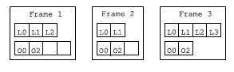

# ASM Methods

介绍如何使用核心 ASM API 生成和转换编译的方法。它首先介绍已编译的方法，然后介绍相应的ASM接口、组件和工具，以生成和转换它们，并提供许多示例。

* [Structure](#Structure)
  * [Execution model](#Executionmodel)
  * [字节码指令](#字节码指令)
  * [Exception handlers](#Exceptionhandlers)
  * [Frames](#Frames)
* [接口和组件](./methods-Interfaces-components.md)

## <a name="Structure">Structure</a>

在编译的类中，方法的代码存储为字节码指令序列。为了生成和转换类，了解这些指令并理解它们是如何工作的至关重要的。本节概述了这些说明，这些说明应该足以开始编写简单类的生成和转换代码。

### <a name="Executionmodel">Execution model</a>

在呈现字节码指令之前，必须先呈现Java虚拟机执行模型。如您所知，Java代码是在线程中执行的。每个线程都有自己的执行堆栈，它由帧(frames)组成。每个帧代表一个方法调用：每次调用方法时，都会在当前线程的执行堆栈上推送一个新帧。当方法返回时，无论是正常返回还是异常返回，此帧都将从执行堆栈中弹出，并在调用方法（其帧现在位于堆栈顶部）中继续执行。

每帧包含两部分：`局部变量`部分和`操作数堆栈`部分。

* 局部变量部分包含可以按随机顺序通过索引访问的变量。
* 操作数堆栈部分是字节码指令用作操作数的值堆栈。这意味着只能以后进先出的顺序访问此堆栈中的值。

**不要混淆操作数堆栈和线程的执行堆栈：执行堆栈中的每个帧都包含自己的操作数堆栈。**

局部变量和操作数堆栈部分的大小取决于方法的代码。它在编译时计算，并与字节码指令一起存储在编译的类中。因此，与给定方法调用相对应的所有帧的大小相同，但对应于不同方法的帧的局部变量和操作数堆栈部分的大小可能不同。



如图，显示了一个3帧的执行堆栈示例。第一帧包含3个局部变量，其操作数堆栈的最大大小为4，并且包含两个值。第二帧包含2个局部变量，操作数堆栈中有两个值。最后第三个帧位于执行堆栈的顶部，包含4个局部变量和两个操作数。

当它被创建时，一个frame用一个空堆栈初始化，它的局部变量用目标对象this（对于非静态方法）和方法的参数初始化。例如，调用方法a.equals(b)将创建一个具有空堆栈的帧，并且前两个局部变量初始化为a和b（其他局部变量未初始化）。

`局部变量`和`操作数堆栈`部分中的每个槽可以保存任何Java值，**long和double值除外。插槽需要两个值**。这使局部变量的管理变得复杂：例如，第i个方法参数不一定存储在局部变量i中。例如，调用`Math.max(1L, 2L)`创建一个帧，其中1L值位于前两个局部变量插槽中，值2L位于第三个和第四个插槽中。

### <a name="字节码指令">[字节码指令](./bytecodeInstructions.md)</a>

本节简要介绍字节码指令。为了完整描述，请参阅Java虚拟机规范。

约定：a和b表示int、float、long或double值（例如:IADD为int，LADD为long），o和p表示objet引用，v表示任何值（or，对于堆栈指令，是大小为1的值），w表示long或double，i、j和n表示int值。

### <a name="Exceptionhandlers">Exception handlers</a>

没有字节码指令来捕获异常：相反，方法的字节码与异常处理程序列表相关联，这些异常处理程序指定在方法的给定部分中引发异常时必须执行的代码。异常处理程序类似于`try-catch`块：它有一个范围，它是一个与try-catch块内容相对应的`指令序列`，以及一个与catch块内容相对应的`处理程序`。**范围由开始和结束标签以及带有开始标签的处理程序指定**。例如下面的源代码：

```java
public static void sleep(long d) {
    try {
        Thread.sleep(d);
    } catch (InterruptedException e) {
        e.printStackTrace();
    }
}
```

can be compiled into:

```asm
TRYCATCHBLOCK try catch catch java/lang/InterruptedException
try:
    LLOAD 0
    INVOKESTATIC java/lang/Thread sleep (J)V
    RETURN
catch:
    INVOKEVIRTUAL java/lang/InterruptedException printStackTrace ()V
    RETURN
```

`try`和`catch`标签之间的代码对应`try块`，而`catch`标签后面的代码对应`catch块`。`TRYCATCHBLOCK`行指定一个异常处理程序，该异常处理程序覆盖try和catch标签之间的范围，处理程序从catch标签开始，对于类是`InterruptedException`子类的异常。这意味着，如果在try和catch之间的任何地方抛出这样的异常，那么堆栈将被清除，该异常将被推送到这个空堆栈上，并在catch处继续执行。

### <a name="Frames">Frames</a>

用Java6或更高版本编译的类除了字节码指令外，还包含一组堆栈映射帧，用于加快Java虚拟机内的类验证过程。堆栈映射帧提供方法在执行期间的某个点的执行帧的状态。更精确地说，它给出了在执行某些特定字节码指令之前，每个局部变量槽和每个操作数堆栈槽中包含的值的类型。

例如，如果我们考虑`getF`方法，我们可以定义三个堆栈映射帧，给出执行帧在`ALOAD`之前、`GETFIELD`之前和`IRETURN`之前的状态。这三个堆栈映射帧对应于图所示的三种情况，可以描述如下，其中第一个方括号之间的类型对应于局部变量，其他方括号之间类型对应于操作数堆栈：

State of the execution frame before |Instruction
---|---
[pkg/Bean] [] |ALOAD 0
[pkg/Bean] [pkg/Bean] |GETFIELD
[pkg/Bean] [I] |IRETURN

We can do the same for the checkAndSetF method:

State of the execution frame before |Instruction
---|---
[pkg/Bean I] [] |ILOAD 1
[pkg/Bean I] [I] |IFLT label
[pkg/Bean I] [] |ALOAD 0
[pkg/Bean I] [pkg/Bean] |ILOAD 1
[pkg/Bean I] [pkg/Bean I] |PUTFIELD
[pkg/Bean I] [] |GOTO end
[pkg/Bean I] [] |label :
[pkg/Bean I] [] |NEW
[pkg/Bean I] [Uninitialized(label)] |DUP
[pkg/Bean I] [Uninitialized(label) Uninitialized(label)] |INVOKESPECIAL
[pkg/Bean I] [java/lang/IllegalArgumentException] |ATHROW
[pkg/Bean I] [] |end :
[pkg/Bean I] [] |RETURN

这与前面的方法类似，只是`Uninitialized(label)`类型除外。这是一种只在堆栈映射帧中使用的特殊类型，**它指定一个内存已分配但尚未调用其构造函数的对象**。参数指定创建此对象的指令。唯一可以对这种类型的值调用的方法是构造函数。当调用它时，该类型在frame中的所有引用都将替换为实类型，这里是IllegalArgumentException。

堆栈映射帧可以使用其他三种特殊类型：

* `UNINITIALIZED_THIS`是构造函数中局部变量0的初始类型
* `TOP`对应于未定义的值
* `NULL`对应于NULL

如上所述，从Java6开始，编译的类除了字节码外，还包含一组堆栈映射帧。为了节省空间，编译后的方法不会为每条指令包含一个帧：**事实上，它只包含与跳转目标或异常处理程序相对应的指令的帧，或遵循无条件跳转指令的指令的帧**。其他的frame可以很容易很快地从这些frame中推断出来。

对于checkAndSetF方法，这意味着只存储两个帧：一个用于`NEW`指令，因为它是`IFLT`指令的目标，但也因为它遵循无条件跳转`GOTO`指令；另一个用于`RETURN`指令，因为它是`GOTO`指令的目标，也因为它遵循“无条件跳转”`ATHROW`指令。

为了节省更多的空间，每个帧通过只存储其与前一帧的差来压缩，而初始帧根本不存储，因为它可以很容易地从方法参数类型中推导出来。在checkAndSetF方法里，必须存储的两个帧相等并且等于初始帧，因此它们被存储为`F_SAME`助记符指定的单字节值。这些帧可以在其相关字节码指令之前表示。

这将给出checkAndSetF方法的最终字节码：

```asm
    ILOAD 1
    IFLT label
    ALOAD 0
    ILOAD 1
    PUTFIELD pkg/Bean f I
    GOTO end
label:
    F_SAME
    NEW java/lang/IllegalArgumentException
    DUP
    INVOKESPECIAL java/lang/IllegalArgumentException <init> ()V
    ATHROW
end:
    F_SAME
    RETURN
```


